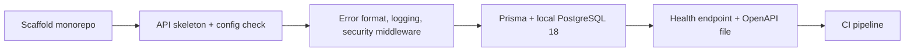

# Monorepo and API foundation

## What and why

Create the empty-but-working skeleton every later task builds on: the
monorepo, a NestJS API that starts, answers a health check and already applies
the project's shared rules (configuration checks, logging without personal
data, one error format, security headers, request-forgery protection, rate
limits), a local PostgreSQL 18 database, and a CI pipeline that checks every
pull request. No product features yet; getting these rules right once means
every later task inherits them instead of reinventing them.

## Workflow

## Manual verification

- From a fresh clone: install, start the local database, start the API, and
  open the health endpoint; it answers in the standard success format.
- Remove a required setting and start the API; it refuses and names the
  setting.
- Send a state-changing request from a foreign origin; it is refused.
- Open a pull request; CI runs every check and passes.

## Risks

- Scaffolding tools may pull in defaults that break constitution rules (error
  format, naming); the review checks these first.
- The harness scaffold prompt also creates root agent and workflow files and
  copies docs; those steps must be skipped so Forge's files stay intact.
- Windows and Linux path differences in scripts and CI; CI runs on Linux,
  local runs on Windows.

---

## Technical notes

- Follow the harness scaffold prompt for the stack and directory layout, with
  the accepted deviations: no Redis or BullMQ, no AWS CDK, no web app yet (the
  web task adds it), no Symphony workflow, no root agent or workflow file, no
  docs copy, no worktree or observability scripts. Root scripts are limited to
  dev, build, test, integration tests, typecheck, lint and database migration
  commands; the scaffold's structural-linter and API-client scripts are left
  out because their targets are outside this task (the web task adds API
  client generation).
- Package manager and runner: pnpm workspaces and Turborepo, package scope
  `@symphony/`, Node 22. A root Vitest configuration with projects lets any
  test run from the repo root by its repo-relative path.
- Configuration: one config module is the only reader of environment
  variables; it validates every variable from the architecture's configuration
  table plus `PORT` (default 3000, set by the host in production) at boot,
  rejecting missing and malformed values such as a bad origin or database URL;
  `OWNER_GOOGLE_ACCOUNT_ID` and the Google and pre-launch values stay optional
  until the accounts task needs them.
- Errors and responses: the constitution envelope and error payload come from
  one global exception filter and one response interceptor; validation errors
  return 400 with field errors.
- Security: Helmet with HSTS, CORS for `WEB_ORIGIN` with credentials, a guard
  requiring `X-Requested-With: cwf` and a matching `Origin` on POST, PATCH and
  DELETE, and in-memory rate limits with a default of 100 per minute per IP
  plus a per-route override mechanism. Route-specific and per-member limits are
  added by the tasks that own those routes (sign-in in the accounts task, join
  in CWF-2, search in CWF-4).
- Test-only probe: integration tests register a small probe controller with
  POST, PATCH and DELETE routes and a validated DTO, living only in test code,
  to exercise the validation format and the forgery guard before any product
  mutation route exists.
- Logging: pino JSON with a correlation id per request. Request logs carry
  method, route pattern, status and duration; bodies, query strings, cookies,
  authorization headers and personal-data fields (email, names, WhatsApp
  numbers, Google account IDs, tokens) are never logged, including in exception
  logs. No console logging.
- Database: Prisma against PostgreSQL 18 from Docker Compose with an initial
  baseline migration and no domain tables; the schema is set up for
  constitution naming, which the accounts task's first tables exercise; the
  connection check proves `uuidv7()` is available.
- OpenAPI: generated from the running app, committed, and compared in CI;
  Swagger UI is disabled in production.
- CI: one GitHub Actions workflow running install, lint, typecheck, unit,
  integration with a PostgreSQL 18 service, build, a production dependency
  audit and the OpenAPI diff. The end-to-end job is added by the web task,
  which introduces Playwright. The existing roadmap gate workflow is untouched.
- Deferred on purpose: the service bus arrives in CWF-2; Google sign-in,
  sessions and the member guard arrive in the accounts task.
